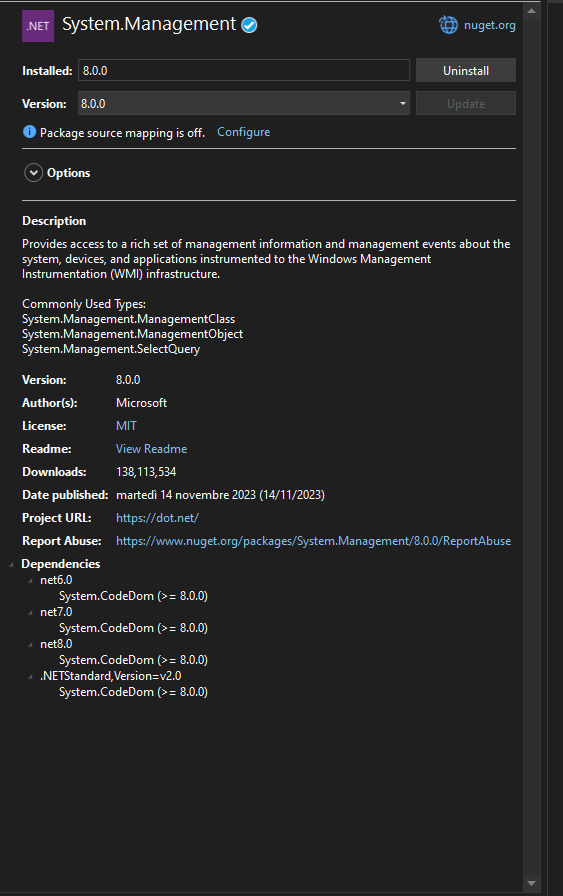
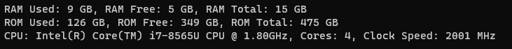

# Inviare i dati RAM, ROM totale Libera e usata e CPU dI windows

scaricare i seguenti pacchetti nuget

- Management



prima parte di configurazione degli using

```C#
using System;
using System.Management;
```

instanzio oggetto della classe Data

```C#
Data data = new Data();
```

Leggi le informazioni sulla RAM, ROM e CPU dal PC locale

```C#
string ramInfo = data.GetRamInfo();
string romInfo = data.GetRomInfo();
string cpuInfo = data.GetCpuInfo();
```

Stampare le informazioni sulla console

```c#
Console.WriteLine(ramInfo);
Console.WriteLine(romInfo);
Console.WriteLine(cpuInfo);
```

implementazione Classe Data con gli using e namespace

```C#
using System.Management;
namespace Windows;
```

crea la classe Data

```C#
class Data
{
    // vari metodi
}
```

dentro la classe Data creo i vari metodi

- ottieni RAM

```C#
    public string GetRamInfo()
    {
        ObjectQuery query = new ObjectQuery("SELECT FreePhysicalMemory, TotalVisibleMemorySize FROM Win32_OperatingSystem");
        ManagementObjectSearcher searcher = new ManagementObjectSearcher(query);

        foreach (ManagementObject mo in searcher.Get())
        {
            ulong freeRam = (ulong)mo["FreePhysicalMemory"]; //RAM libera
            ulong totalRam = (ulong)mo["TotalVisibleMemorySize"]; //RAM Totale
            ulong usedRam = totalRam - freeRam; //RAM Usata


            return $"RAM Used: {usedRam / (1024 * 1024)} GB, RAM Free: {freeRam / (1024 * 1024)} GB, RAM Total: {totalRam / (1024 * 1024)} GB"; //Stampa Info

        }

        return "RAM information not available";
    }
```

- Ottieni ROM

```C#
    public string GetRomInfo()
    {
        ObjectQuery query = new ObjectQuery("SELECT FreeSpace, Size FROM Win32_LogicalDisk WHERE DeviceID = 'C:'");
        ManagementObjectSearcher searcher = new ManagementObjectSearcher(query);

        foreach (ManagementObject mo in searcher.Get())
        {
            ulong freeSpace = (ulong)mo["FreeSpace"]; //ROM libera
            ulong totalSize = (ulong)mo["Size"];      //ROM Totale
            ulong usedSpace = totalSize - freeSpace;  //ROM Usata

            return $"ROM Used: {usedSpace / (1024 * 1024 * 1024)} GB, ROM Free: {freeSpace / (1024 * 1024 * 1024)} GB, ROM Total: {totalSize / (1024 * 1024 * 1024)} GB"; //Stampa Info
        }
        return "ROM information not available";
    }
```

- Ottieni Info CPU

```C#
    public string GetCpuInfo()
    {
        ObjectQuery query = new ObjectQuery("SELECT * FROM Win32_Processor");
        ManagementObjectSearcher searcher = new ManagementObjectSearcher(query);
        string cpuInfo = "";

        foreach (ManagementObject mo in searcher.Get())
            cpuInfo = $"CPU: {mo["Name"]}, Cores: {mo["NumberOfCores"]}, Clock Speed: {mo["MaxClockSpeed"]} MHz"; //ottene info sulla CPU

        return cpuInfo;
    }
```

Infine programma funzionate alla fine


